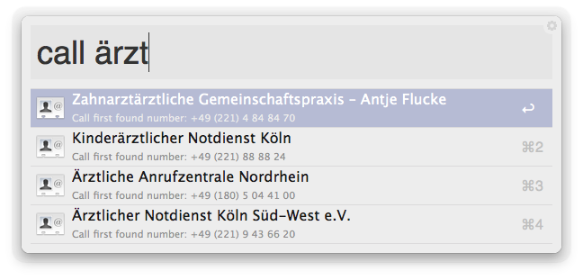

# Dial with PushDialer workflow for Alfred 2

An [Alfred 2 workflow][alfred] making it easy to dial phone numbers from OS X contacts, text selected in any OS X application, or the Alfred prompt with [PushDialer][pushdialer]. Note you need the [Alfred Powerpack][alfred-powerpack] to enable workflows.

## Usage

### Using it with OS X contacts

The workflow offers two different ways to dial addresses retrieved from OS X’ contacts store with Alfred:

1. it defines a custom contacts action which will dial a number when actioned from Alfred’s contacts viewer. For this to work, assign the “Dial” action to phone numbers in Alfred’s Contacts settings (found in *Preferences » Features » Contacts » Contacts*):

    
    
2. it offers a `call` keyword that will return phone numbers for contacts matching the query, right in the Alfred result window:

    
    
    `call` returns the first found of the home, work and mobile phone numbers for contacts whose name or company name matches the query. If you want to specifically target home, work or mobile numbers, `call`’s brethren `callh`, `callw` and `callm` will do your bidding.
    
    Note the search is case sensitive if your query starts with an upper case letter, case agnostic if not (i.e. “Cool” finds “Liquid Coolants Ltd.”, but not “Mancoolie”, while “cool” finds both).

### Using it with text selected in OS X applications

There are two hotkeys defined to get selected text into the workflow: the first will run the selected text straight through the dial routine, the other will put it into the Alfred prompt, ready to execute. Note Alfred strips the keyboard shortcuts on workflow installation, so you will have to set your own *Preferences » Workflows » Dial with PushDialer*.

### Using it from the Alfred prompt

The workflow defines a `dial` keyword: any query that follows it is passed to the dial routine.

## Updating

Dial with PushDialer supports [Alleyoop][alleyoop] for automated updates. [Install Alleyoop][alleyoop-download] and do `oop`.

## Known bugs

* If you miss mobile numbers in feedback, make sure the phone label in the Contacts application is not set to “iPhone” – that label is not recognized by the utility used to query the Contacts store.
* Alfred version 2.0.2 seems not to pass query parameters containing non-ASCII characters correctly to script filters. The `call` filters will not match such queries until this is resolved. 

## Credits and License

Inspired by the PushDialer workflow by [Florian Pellet][pellet-workflows].

The `call` keyword family relies on the [*contacts* utility by Shane Celis][contacts-util] to provide its results. Contacts is licensed under the GPL version 2. As it is distributed with the workflow, this means the Dial with PushDialer workflow is also distributed under the terms of the [General Public License version 2][gpl2].

## Contributing

1. fork the repo
2. commit you changes
3. make sure you haven’t broken anything (better: write some tests!)
4. submit a pull request

[alfred]:           http://www.alfredapp.com
[alfred-powerpack]: http://www.alfredapp.com/powerpack/
[alleyoop]:         http://alfred.daniel.sh
[alleyoop-download]:http://alfred.daniel.sh/Workflows/Alleyoop.alfredworkflow
[contacts-util]:    http://www.gnufoo.org/contacts/contacts.html
[gpl2]:             http://www.gnu.org/licenses/gpl-2.0.html
[pellet-workflows]: http://florianpellet.com/alfred/
[pushdialer]:       http://pushdialer.com
